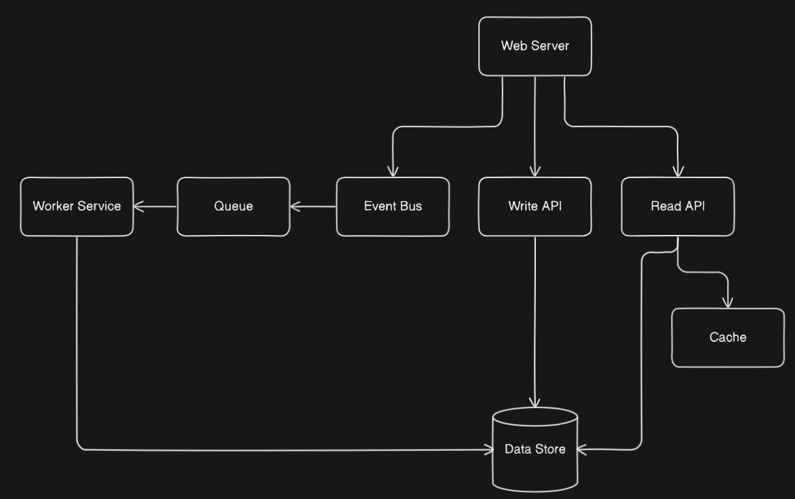

# Background Worker System - Multi-Tenant Car Wash Platform

## 📘 Overview

This project demonstrates a scalable and extensible background worker system for a multi-tenant car wash application. It supports high-throughput background tasks, multi-scope execution (global vs tenant), durable state management, and easy developer extensibility.

The solution is implemented as a .NET Console Application and simulates processing customer actions, employee uploads, and scheduled financial data sync.

---

## 🧱 Key Design Goals

- **Multi-Tenant Awareness**: Supports tenant-scoped and global workers.
- **Extensibility**: Easily add new workers and scopes.
- **Durability**: Persist state between executions.
- **High Throughput**: Designed to handle large workloads.
- **Developer-Friendly**: Abstract base classes and in-memory services allow easy prototyping.

---

## 🧩 Core Components

| Component                      | Description                                                              |
|--------------------------------|--------------------------------------------------------------------------|
| `IQueueService`                | Abstract message queue service to dispatch and process background tasks. |
| `ITriggerService`              | Abstract trigger system to initiate workflows (e.g., scheduled jobs).    |
| `IDatabaseService`             | In-memory data access abstraction simulating persistence.                |
| `BaseWorker<TState, TMessage>` | Generic base class for implementing message-based workers.               |
| `WorkerStateBase`              | Generic serialized worker state storage.                                 |

---

## 🧠 Design Patterns Used

- **Strategy Pattern**: For polymorphic background worker implementations.
- **Template Method**: Workers extend `BaseWorker` and implement `ExecuteWorkerLogicAsync`.
- **Observer Pattern**: Trigger and queue services allow dynamic subscription to events.
- **Repository Pattern**: Abstracted DB interaction via `IDatabaseService`.

---

## 🚀 Worker Types

### 1. Customer Action Worker
- Fan-out email and credit application jobs per customer.
- Simulates high throughput processing.
- Subscribed via `QueueService`.

### 2. Employee Upload Worker
- Processes staged CSV rows for each tenant.
- Simulates 50+ uploads per tenant.

### 3. Financial Sync Worker *(optional if included)*
- Triggered periodically.
- Intended to load state (cursor), queues sync jobs, and saves updated state.
- Currently implemented through Orchestrator

---

### High Level Design


---

## 🔁 Execution Flow

```text
TriggerService
     ↓
[Orchestrator] → QueueService → [Subscribed Worker] → Process Message
